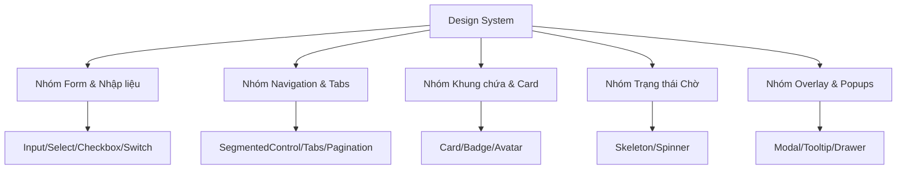

# Kế hoạch Xây dựng Hệ thống Thiết kế & Thư viện Component (Design System & Component Library Plan)

Tài liệu này phân tích tất cả các thành phần giao diện (UI) đang lặp lại hoặc thiếu tính nhất quán trong dự án **Travelist**, từ đó hoạch định kế hoạch xây dựng một hệ thống thiết kế (Design System) đồng bộ, giúp mã nguồn sạch hơn, dễ bảo trì và tối ưu cho việc nhúng (embed) vào các nền tảng khác.

---

## 1. Phân tích Các Loại Component cần Chuẩn hóa (UI Component Inventory)

Qua rà soát toàn bộ dự án ([LandingPage.jsx](file:///home/michael/code/EXE/EXEfrondend/src/features/trip-planner/components/LandingPage.jsx), [TripPlannerStudio.jsx](file:///home/michael/code/EXE/EXEfrondend/src/features/trip-planner/components/TripPlannerStudio.jsx), [CommunityFeed.jsx](file:///home/michael/code/EXE/EXEfrondend/src/features/social/components/CommunityFeed.jsx), [AuthModal.jsx](file:///home/michael/code/EXE/EXEfrondend/src/components/layout/AuthModal.jsx)), chúng ta cần chuẩn hóa 8 nhóm component chính sau:



### 1.1. Nhóm Form & Trường nhập liệu (Form Inputs)
*   **Hiện trạng**: Các thẻ `<input>`, `<select>` tự viết rải rác có style khác nhau, nút bấm checkbox/select trong form lọc của LandingPage và đăng nhập của AuthModal không đồng đều về khoảng cách padding và độ bo góc.
*   **Đề xuất chuẩn hóa**:
    *   `Input`: Trường nhập văn bản, mật khẩu, số. Hỗ trợ hiển thị nhãn (label), thông báo lỗi dưới chân (error state) và trạng thái vô hiệu hóa (disabled).
    *   `Select`: Hộp chọn dropdown tùy biến kích thước và có mũi tên đồng bộ.
    *   `Checkbox`/`Switch`: Trình chọn bật/tắt (toggle) dạng thanh gạt cao cấp thay thế cho checkbox mặc định của trình duyệt.

### 1.2. Nhóm Chuyển đổi & Phân trang (Navigation & Tabs)
*   **Hiện trạng**:
    *   Thanh chọn ngày (Day 1, Day 2, Day 3) và thanh chuyển Bản đồ/Chi phí trong Studio sử dụng các nút bấm tự code với class chuyển đổi thủ công.
    *   Thanh phân trang (Pagination) ở LandingPage và CommunityFeed viết lại code logic tính toán toán học nhiều lần.
*   **Đề xuất chuẩn hóa**:
    *   `Tabs`: Thanh chuyển đổi tab có hiệu ứng chuyển cảnh mềm mại (sliding active state indicator).
    *   `SegmentedControl`: Thanh nút gạt lựa chọn độc quyền (như chọn Map / Cost trong Studio).
    *   `Pagination`: Thành phần phân trang chuẩn nhận vào `currentPage`, `totalPages`, `onPageChange` dùng chung cho toàn bộ danh sách.

### 1.3. Nhóm Khung chứa & Hiển thị thông tin (Data Display)
*   **Hiện trạng**:
    *   Các nhãn thể loại ("Ẩm thực", "Nghỉ dưỡng", "Chuyên gia") có độ dày viền, độ mờ nền và màu chữ khác nhau tùy màn hình.
    *   Khung ảnh đại diện (Avatars) của người dùng ở Header, Feed và Chatbot có kích thước và đường viền không đồng bộ.
*   **Đề xuất chuẩn hóa**:
    *   `Card`: Khung bo góc mờ (`backdrop-blur`) có đổ bóng nhẹ làm nền tảng cho mọi thẻ nội dung.
    *   `Badge`: Nhãn thể loại nhỏ gọn, tự động đổi màu theo thuộc tính (Ví dụ: `success` -> màu xanh lá, `warning` -> màu hổ phách).
    *   `Avatar`: Hiển thị ảnh đại diện hình tròn, hỗ trợ chữ cái đại diện khi không có ảnh (fallback letter) và hiển thị chấm xanh báo online.

### 1.4. Nhóm Trạng thái chờ (Feedback & Loading)
*   **Hiện trạng**: Dự án sử dụng hiệu ứng lấp lánh (Shimmer loading skeleton) cho thẻ địa điểm ở LandingPage nhưng viết CSS cứng bằng Tailwind. Ở Studio lại sử dụng vòng quay spin truyền thống.
*   **Đề xuất chuẩn hóa**:
    *   `Skeleton`: Thành phần khung xương giả lập bố cục trong lúc tải dữ liệu (hỗ trợ các hình dáng `circle`, `rect`, `textLine`).
    *   `Spinner`: Vòng xoay tiến trình đồng bộ màu sắc thương hiệu.

### 1.5. Nhóm Cửa sổ nổi (Overlays & Dialogs)
*   **Hiện trạng**: Hộp thoại hiển thị chi tiết địa điểm du lịch, hộp thoại xác nhận đổi điểm đến, hộp thoại Đăng ký/Đăng nhập đang code lồng trực tiếp vào luồng HTML chính, gây phình to file code cha.
*   **Đề xuất chuẩn hóa**:
    *   `Modal`: Hộp thoại nổi có lớp nền tối làm mờ phía sau (`backdrop-blur backdrop-darken`), tự động căn giữa màn hình, hỗ trợ Esc để đóng.
    *   `Tooltip`: Bong bóng gợi ý nhỏ khi di chuột vào các icon nhỏ hoặc vị trí trên bản đồ.

---

## 2. Thiết kế API cho các Component lõi (API Spec)

Dưới đây là thiết kế mã nguồn của một số component quan trọng để chuẩn bị triển khai:

### 2.1. Component `Input` (`src/components/ui/Input/Input.jsx`)
```jsx
export default function Input({
  label,
  error,
  icon: Icon,
  className = "",
  id,
  ...props
}) {
  return (
    <div className="flex flex-col gap-1.5 w-full">
      {label && (
        <label htmlFor={id} className="text-xs sm:text-sm font-bold text-gray-700">
          {label}
        </label>
      )}
      <div className="relative flex items-center">
        {Icon && <Icon className="absolute left-3.5 w-4 h-4 text-gray-400 pointer-events-none" />}
        <input
          id={id}
          className={`w-full bg-white border border-gray-200 text-sm rounded-xl px-4 py-2.5 outline-none transition-all duration-300 focus:border-heritage-amber focus:ring-4 focus:ring-heritage-amber/10 ${Icon ? 'pl-10' : ''} ${error ? 'border-red-500 focus:ring-red-500/10' : ''} ${className}`}
          {...props}
        />
      </div>
      {error && <span className="text-xs font-semibold text-red-500">{error}</span>}
    </div>
  );
}
```

### 2.2. Component `Badge` (`src/components/ui/Badge/Badge.jsx`)
```jsx
const STYLES = {
  primary: 'bg-heritage-amber/10 text-heritage-amber border-heritage-amber/20',
  success: 'bg-green-50 text-ricefield-green border-ricefield-green/20',
  warning: 'bg-amber-50 text-amber-600 border-amber-200',
  danger: 'bg-red-50 text-red-650 border-red-200',
  neutral: 'bg-gray-150 text-gray-500 border-gray-250',
};

export default function Badge({ children, variant = 'primary', className = '' }) {
  const badgeStyle = STYLES[variant] || STYLES.primary;
  return (
    <span className={`inline-flex items-center px-2 py-0.5 rounded text-[10px] sm:text-[11px] font-black uppercase tracking-wider border border-solid leading-none ${badgeStyle} ${className}`}>
      {children}
    </span>
  );
}
```

---

## 3. Lộ trình Thực hiện Toàn diện (Action Roadmap)

Để tránh đứt gãy luồng làm việc hiện tại, chúng ta sẽ thực hiện theo 4 giai đoạn cuốn chiếu:

| Giai đoạn | Nội dung công việc | Component mục tiêu | Tệp tin bị ảnh hưởng |
| :--- | :--- | :--- | :--- |
| **Giai đoạn 1** | Xây dựng Bộ thành phần nguyên tử dùng chung (UI Atoms) | `Button`, `Alert`, `Input`, `Badge` | Khai báo mới trong `src/components/ui/` |
| **Giai đoạn 2** | Xây dựng Bộ thành phần khung & điều hướng (Layout Atoms) | `Modal`, `Tabs`, `Avatar`, `Skeleton` | Khai báo mới trong `src/components/ui/` |
| **Giai đoạn 3** | Tái cấu trúc thay thế trên LandingPage & AuthModal | Thay thế `<button>`, `<input>`, `loading` cũ bằng component mới | `LandingPage.jsx`, `AuthModal.jsx` |
| **Giai đoạn 4** | Phân rã tệp khổng lồ TripPlannerStudio | Tách `LeafletMap`, `Timeline`, `SavedList` thành các component phụ | `TripPlannerStudio.jsx` |

---

## 4. Lợi ích Tối ưu mang lại (Benefits)
1.  **Dung lượng code giảm ~35%**: Loại bỏ hoàn toàn hàng ngàn dòng code CSS và HTML trùng lặp.
2.  **Đồng bộ trải nghiệm (Visual Consistency)**: Trải nghiệm nhất quán trên mọi trang web (khoảng cách viền, hiệu ứng hover, kích cỡ chữ).
3.  **Khả năng mở rộng vượt trội**: Khi cần sửa đổi phong cách thương hiệu (ví dụ: đổi màu `heritage-amber` sang màu xanh dương), chỉ cần sửa đổi duy nhất tại 1 tệp Component Ui gốc.
