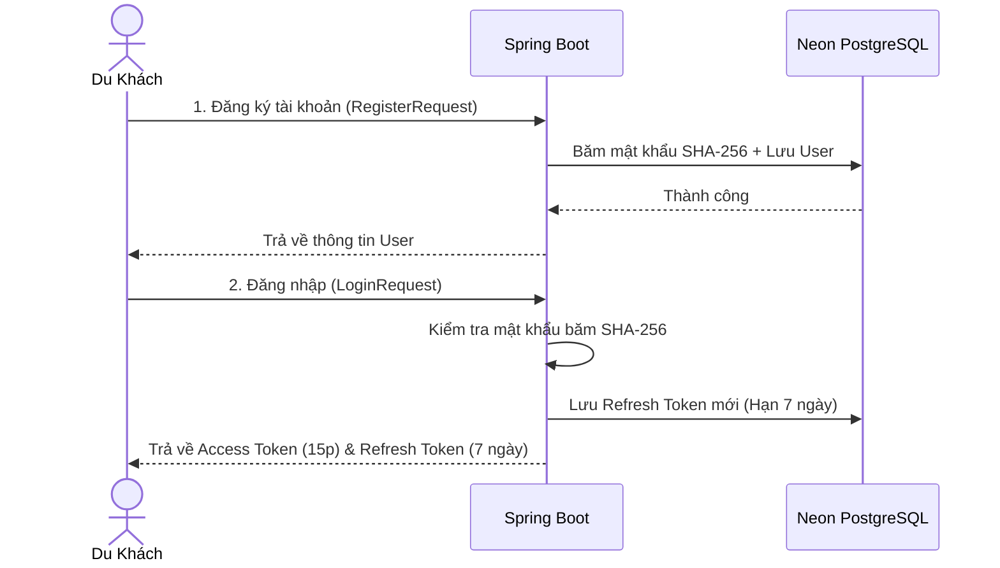
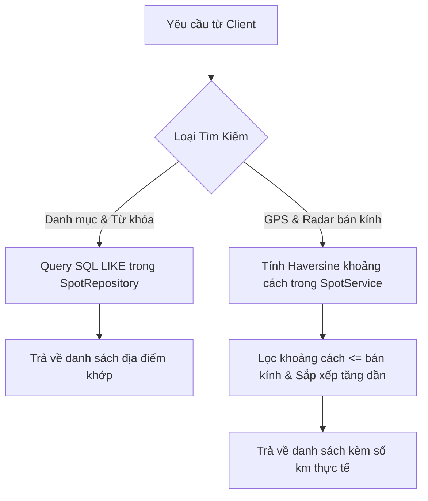
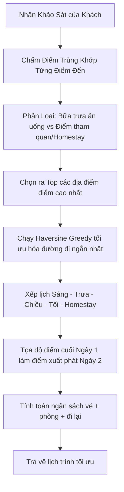
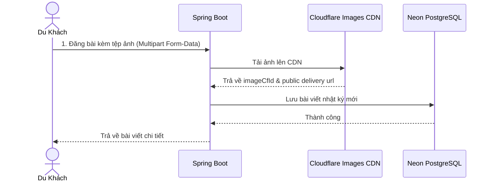
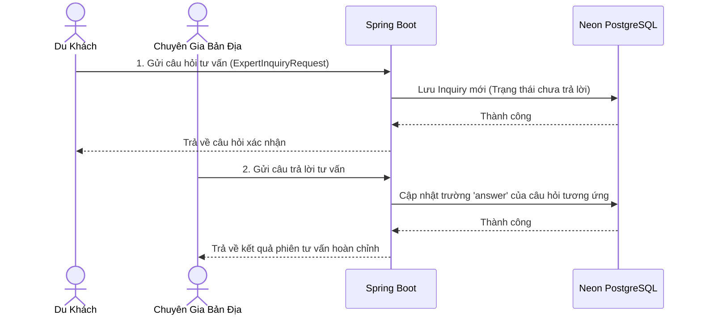

# 🧭 Hướng Dẫn Kiểm Thử APIs HISTRA Với Postman & Đặc Tả Nghiệp Vụ

Tài liệu này cung cấp chi tiết danh sách chức năng, luồng nghiệp vụ (**Workflow**) và hướng dẫn từng bước để kiểm thử các cổng API của hệ thống **HISTRA Backend** bằng công cụ **Postman**.

---

## 🏛️ I. Tổng Quan Kiến Trúc Hệ Thống & Cài Đặt Ban Đầu

### 1. Thông tin cấu hình
*   **Địa chỉ Server Local:** `http://localhost:8080` (Cổng mặc định của Spring Boot)
*   **Tiền tố API:** `/api/v1`
*   **Cơ sở dữ liệu:** Neon PostgreSQL (Đã tích hợp và tự động khởi tạo bảng)
*   **Định dạng phản hồi chuẩn (API Envelope):**
    ```json
    {
        "success": true, // hoặc false
        "message": "Thông điệp mô tả kết quả xử lý",
        "data": { ... }, // Dữ liệu trả về (null nếu thất bại)
        "errorCode": null, // Mã lỗi hệ thống (null nếu thành công)
        "timestamp": "2026-05-26T17:48:00"
    }
    ```

### 2. Chuẩn bị trên Postman
*   Đặt `Content-Type: application/json` cho tất cả các Request Body dạng JSON.
*   Đối với các API bảo mật (yêu cầu xác thực), chọn tab **Authorization** trên Postman $\rightarrow$ Chọn loại **Bearer Token** $\rightarrow$ Dán mã `accessToken` nhận được sau khi đăng nhập.

---

## 🔑 II. Chi Tiết Chức Năng, Quy Trình & Hướng Dẫn Kiểm Thử Từng Phân Hệ

### 📌 Phân Hệ 1: Xác Thực & Quản Lý Phiên Làm Việc (Auth JWT)
**Nhiệm vụ:** Quản lý đăng ký, đăng nhập bảo mật và duy trì phiên làm việc không bị gián đoạn.

#### 🔄 Luồng Nghiệp Vụ (Workflow):


---

#### 🧪 Hướng dẫn kiểm thử Postman:

##### 1. Đăng ký tài khoản mới (Register)
*   **Method:** `POST`
*   **URL:** `http://localhost:8080/api/v1/auth/register`
*   **Body (JSON):**
    ```json
    {
        "email": "new_traveler@histra.vn",
        "password": "mysecretpassword123",
        "fullName": "Trần Du Lịch"
    }
    ```
*   **Phản hồi mẫu thành công (200 OK):**
    ```json
    {
        "success": true,
        "message": "Đăng ký tài khoản thành công!",
        "data": {
            "id": 3,
            "email": "new_traveler@histra.vn",
            "fullName": "Trần Du Lịch",
            "role": "USER",
            "avatarUrl": "https://images.unsplash.com/photo-1534528741775-53994a69daeb?auto=format&fit=crop&w=100&q=80",
            "enabled": true
        }
    }
    ```

##### 2. Đăng nhập hệ thống (Login)
*   **Method:** `POST`
*   **URL:** `http://localhost:8080/api/v1/auth/login`
*   **Body (JSON):**
    ```json
    {
        "email": "traveler@histra.vn",
        "password": "12345678"
    }
    ```
*   **Phản hồi mẫu thành công (200 OK):**
    > [!IMPORTANT]
    > Hãy sao chép mã `accessToken` ở phản hồi này để dán vào cấu hình **Bearer Token** của các API bảo mật tiếp theo.
    ```json
    {
        "success": true,
        "message": "Đăng nhập thành công!",
        "data": {
            "accessToken": "eyJhbGciOiJIUzI1NiJ9.eyJzdWIiOiIxIiwiZW1haWwiOiJ0cmF2ZWxlckBoaXN0cmEudm4iLCJyb2xlIjoiVVNFUiIsImZ1bGxOYW1lIjoiTmd1eWVuIER1IEtoYWNoIiwiaWF0IjoxNzg1Mjc4ODAwLCJleHAiOjE3ODUyNzk3MDB9...",
            "refreshToken": "48b6c59b-26a1-432d-94c6-2c938fbe88a1",
            "user": {
                "id": 1,
                "email": "traveler@histra.vn",
                "fullName": "Nguyễn Du Khách",
                "role": "USER",
                "avatarUrl": "https://images.unsplash.com/photo-1534528741775-53994a69daeb?auto=format&fit=crop&w=100&q=80"
            }
        }
    }
    ```

##### 3. Làm mới Access Token đã hết hạn (Refresh)
*   **Method:** `POST`
*   **URL:** `http://localhost:8080/api/v1/auth/refresh`
*   **Body (JSON):**
    ```json
    {
        "refreshToken": "dán_mã_refreshToken_ở_đây"
    }
    ```
*   **Phản hồi mẫu thành công (200 OK):**
    ```json
    {
        "success": true,
        "message": "Làm mới Token JWT thành công!",
        "data": {
            "accessToken": "mã_jwt_mới_được_cấp"
        }
    }
    ```

---

### 🗺️ Phân Hệ 2: Tìm Kiếm Địa Điểm & Định Vị Radar (Spots & Radar)
**Nhiệm vụ:** Tìm kiếm điểm đến đa ngôn ngữ, lọc theo danh mục, xem chi tiết và quét tọa độ GPS tìm các địa điểm lân cận.

#### 🔄 Luồng Nghiệp Vụ (Workflow):


---

#### 🧪 Hướng dẫn kiểm thử Postman:

##### 1. Lọc và Tìm kiếm địa điểm du lịch
*   **Method:** `GET`
*   **URL:** `http://localhost:8080/api/v1/spots?category=cafe&keyword=Faifo`
    *   *Mẹo:* Bạn có thể để trống các tham số để lấy toàn bộ địa điểm: `http://localhost:8080/api/v1/spots`
*   **Phản hồi mẫu thành công (200 OK):**
    ```json
    {
        "success": true,
        "message": "Lấy danh sách địa điểm thành công!",
        "data": [
            {
                "id": 2,
                "nameVi": "Faifo Coffee Đọc Sách",
                "nameEn": "Faifo Coffee Rooftop",
                "category": "cafe",
                "tags": "cafe,healing,chill,romantic,photo",
                "latitude": 15.8778,
                "longitude": 108.3282,
                "averageCost": 80000,
                "estimatedDurationMinutes": 60,
                "rating": 4.6,
                "suitableFor": "couple,solo",
                "timeOfDay": "afternoon,evening",
                "imageUrl": "https://images.unsplash.com/photo-1447078806655-409295609806?auto=format&fit=crop&w=500&q=80",
                "descriptionVi": "Quán cafe sân thượng nổi tiếng sở hữu góc nhìn toàn cảnh những mái ngói rêu phong của phố cổ Hội An."
            }
        ]
    }
    ```

##### 2. Lấy thông tin chi tiết một địa điểm
*   **Method:** `GET`
*   **URL:** `http://localhost:8080/api/v1/spots/1`
*   **Phản hồi mẫu thành công (200 OK):**
    ```json
    {
        "success": true,
        "message": "Lấy chi tiết địa điểm thành công!",
        "data": {
            "id": 1,
            "nameVi": "Chùa Cầu Nhật Bản",
            "nameEn": "Japanese Covered Bridge",
            "category": "sightseeing"
            // ... đầy đủ thông tin chi tiết
        }
    }
    ```

##### 3. Tìm kiếm bằng Radar GPS lân cận
*   **Method:** `GET`
*   **URL:** `http://localhost:8080/api/v1/spots/nearby?lat=15.8770&lng=108.3260&radius=5.0`
    *   *Tham số:* `lat` (Vĩ độ người dùng), `lng` (Kinh độ người dùng), `radius` (Bán kính tìm kiếm - mặc định 5.0 km).
*   **Phản hồi mẫu thành công (200 OK):**
    ```json
    {
        "success": true,
        "message": "Tìm kiếm các địa điểm lân cận thành công!",
        "data": [
            {
                "spot": {
                    "id": 1,
                    "nameVi": "Chùa Cầu Nhật Bản",
                    "latitude": 15.8772,
                    "longitude": 108.3262
                },
                "distance": 0.03 // Cách chỉ 30 mét (0.03 km)!
            },
            {
                "spot": {
                    "id": 2,
                    "nameVi": "Faifo Coffee Đọc Sách",
                    "latitude": 15.8778,
                    "longitude": 108.3282
                },
                "distance": 0.25 // Cách 250 mét!
            }
        ]
    }
    ```

---

### 🧠 Phân Hệ 3: Lập Lịch Trình Tự Động Với Trí Tuệ Nhân Tạo (AI Trip Planner)
**Nhiệm vụ:** Nhận khảo sát sở thích của người dùng để tính điểm khớp, tối ưu hóa tuyến đường di chuyển ngắn nhất và phân bổ buổi hoạt động hợp lý.

#### 🔄 Luồng Nghiệp Vụ (Workflow):


---

#### 🧪 Hướng dẫn kiểm thử Postman:

##### 1. Sinh lịch trình du lịch tự động
*   **Method:** `POST`
*   **URL:** `http://localhost:8080/api/v1/trips/generate`
*   **Body (JSON):**
    ```json
    {
        "days": 2,
        "budget": 5000000,
        "style": "healing",
        "people": 2,
        "groupType": "couple",
        "interests": ["culture", "photo", "healing"],
        "currentLat": 15.8770,
        "currentLng": 108.3260
    }
    ```
*   **Phản hồi mẫu thành công (200 OK):**
    ```json
    {
        "success": true,
        "message": "Sinh lịch trình du lịch tối ưu thành công!",
        "data": {
            "totalCost": 2240000, // Tổng dự toán chi phí cho cả nhóm
            "activityCost": 640000, // Chi phí vé tham quan & ăn uống thực tế
            "hotelEstimate": 1200000, // Ước tính homestay (300k/người/ngày)
            "transportEstimate": 400000, // Ước tính di chuyển xăng xe (100k/người/ngày)
            "days": [
                {
                    "day": 1,
                    "spots": [
                        {
                            "slot": "MORNING",
                            "time": "08:00",
                            "spot": { "id": 1, "nameVi": "Chùa Cầu Nhật Bản" }
                        },
                        {
                            "slot": "LUNCH",
                            "time": "12:00",
                            "spot": { "id": 3, "nameVi": "Cơm Gà Bà Buội" } // Bữa trưa đặc sản bắt buộc!
                        },
                        {
                            "slot": "AFTERNOON",
                            "time": "15:00",
                            "spot": { "id": 2, "nameVi": "Faifo Coffee Đọc Sách" }
                        },
                        {
                            "slot": "STAY",
                            "time": "21:00",
                            "spot": { "id": 5, "nameVi": "Khách sạn Little Hoi An Boutique" }
                        }
                    ]
                }
            ]
        }
    }
    ```

---

### 📸 Phân Hệ 4: Tạp Chí Nhật Ký Du Ký & Bình Luận (Community Feed)
**Nhiệm vụ:** Đăng tải trải nghiệm thực tế kèm ảnh Cloudflare, tương tác thả tim và bình luận trả lời đa tầng.

#### 🔄 Luồng Nghiệp Vụ (Workflow):


---

#### 🧪 Hướng dẫn kiểm thử Postman:

##### 1. Lấy danh sách bài viết du ký cộng đồng (Feed)
*   **Method:** `GET`
*   **URL:** `http://localhost:8080/api/v1/diaries?category=healing`
    *   *Mẹo:* Có thể lọc theo `healing`, `food`, `adventure`, `scenic` hoặc để trống để lấy tất cả.
*   **Phản hồi mẫu thành công (200 OK):**
    ```json
    {
        "success": true,
        "message": "Lấy danh sách nhật ký du ký thành công!",
        "data": [
            {
                "id": 1,
                "category": "healing",
                "contentVi": "Một buổi sáng bình yên tản bộ quanh phố cổ Hội An...",
                "imageUrl": "https://images.unsplash.com/photo-1571896349842-33c89424de2d?auto=format&fit=crop&w=600&q=80",
                "likesCount": 42,
                "createdAt": "2026-05-26T10:40:00",
                "user": {
                    "id": 1,
                    "fullName": "Nguyễn Du Khách",
                    "avatarUrl": "https://images.unsplash.com/photo-1534528741775-53994a69daeb?auto=format&fit=crop&w=100&q=80"
                },
                "comments": [
                    {
                        "id": 1,
                        "content": "Hình ảnh chụp đẹp xuất sắc bạn ơi!",
                        "parentCommentId": null,
                        "user": { "id": 2, "fullName": "Trần Admin" }
                    }
                ]
            }
        ]
    }
    ```

##### 2. Đăng bài viết du ký kèm tệp ảnh (Đăng bài viết mới)
*   **Method:** `POST`
*   **URL:** `http://localhost:8080/api/v1/diaries`
*   **Body:** Chọn loại **form-data** trong Postman và thiết lập các trường sau:
    *   `userId` (text): `1`
    *   `category` (text): `adventure`
    *   `contentVi` (text): `Hành trình thúng lắc cực kỳ phấn khích tại Rừng Dừa!`
    *   `contentEn` (text): `Exciting basket boat performance at Coconut Forest!`
    *   `spotId` (text): `4` (Không bắt buộc)
    *   `image` (file): *Nhấn chọn File và tải lên 1 tệp ảnh ngẫu nhiên từ máy tính của bạn.*
*   **Phản hồi mẫu thành công (200 OK):**
    ```json
    {
        "success": true,
        "message": "Đăng tải bài viết nhật ký du ký thành công!",
        "data": {
            "id": 3,
            "category": "adventure",
            "contentVi": "Hành trình thúng lắc cực kỳ phấn khích tại Rừng Dừa!",
            "imageUrl": "https://images.unsplash.com/photo-1555939594-58d7cb561ad1?auto=format&fit=crop&w=600&q=80" // CDN Cloudflare
            // ... thông tin chi tiết bài viết vừa tạo
        }
    }
    ```

##### 3. Tương tác Thả tim cho bài viết (Like)
*   **Method:** `POST`
*   **URL:** `http://localhost:8080/api/v1/diaries/1/like`
*   **Phản hồi mẫu thành công (200 OK):**
    ```json
    {
        "success": true,
        "message": "Thả tim bài viết thành công!",
        "data": null
    }
    ```

##### 4. Bình luận / Phản hồi dưới bài viết (Comments)
*   **Method:** `POST`
*   **URL:** `http://localhost:8080/api/v1/diaries/1/comments`
*   **Body (JSON):**
    ```json
    {
        "userId": 1,
        "content": "Cảm ơn bạn đã phản hồi nhiệt tình!",
        "parentCommentId": 1 // Nhập ID bình luận cha nếu muốn trả lời lồng nhau, hoặc null để bình luận trực tiếp
    }
    ```
*   **Phản hồi mẫu thành công (200 OK):**
    ```json
    {
        "success": true,
        "message": "Đăng bình luận thành công!",
        "data": {
            "id": 3,
            "content": "Cảm ơn bạn đã phản hồi nhiệt tình!",
            "parentCommentId": 1,
            "createdAt": "2026-05-26T17:48:30"
        }
    }
    ```

---

### 💬 Phân Hệ 5: Hỏi Đáp Tư Vấn Với Chuyên Gia Bản Địa (Expert Consulting)
**Nhiệm vụ:** Hỏi đáp trực tuyến với hướng dẫn viên địa phương, ghi nhận trạng thái hoạt động và phản hồi tư vấn.

#### 🔄 Luồng Nghiệp Vụ (Workflow):


---

#### 🧪 Hướng dẫn kiểm thử Postman:

##### 1. Lấy danh sách các chuyên gia bản địa hoạt động
*   **Method:** `GET`
*   **URL:** `http://localhost:8080/api/v1/experts?online=true`
    *   *Tham số:* `online` (boolean) - `true` để lấy chuyên gia đang trực tuyến, bỏ qua để lấy toàn bộ danh sách.
*   **Phản hồi mẫu thành công (200 OK):**
    ```json
    {
        "success": true,
        "message": "Lấy danh sách chuyên gia bản địa thành công!",
        "data": [
            {
                "id": 1,
                "expertise": "Ẩm thực & Di sản văn hóa cổ kính Hội An",
                "descriptionVi": "Chào bạn! Tôi sinh ra và lớn lên tại Hội An...",
                "isOnline": true,
                "rating": 4.9,
                "user": {
                    "id": 2,
                    "fullName": "Trần Admin",
                    "avatarUrl": "https://images.unsplash.com/photo-1507003211169-0a1dd7228f2d?auto=format&fit=crop&w=100&q=80"
                }
            }
        ]
    }
    ```

##### 2. Du khách gửi câu hỏi tư vấn mới
*   **Method:** `POST`
*   **URL:** `http://localhost:8080/api/v1/experts/inquiries`
*   **Body (JSON):**
    ```json
    {
        "expertId": 1,
        "userId": 1,
        "question": "Chào chuyên gia, mình định đi may đồ lấy ngay ở Hội An thì tiệm nào may chuẩn form nhất ạ?"
    }
    ```
*   **Phản hồi mẫu thành công (200 OK):**
    ```json
    {
        "success": true,
        "message": "Gửi câu hỏi tới chuyên gia thành công!",
        "data": {
            "id": 2,
            "question": "Chào chuyên gia, mình định đi may đồ lấy ngay ở Hội An thì tiệm nào may chuẩn form nhất ạ?",
            "answer": null, // Chưa có câu trả lời
            "createdAt": "2026-05-26T17:49:10",
            "expertName": "Trần Admin",
            "userName": "Nguyễn Du Khách"
        }
    }
    ```

##### 3. Chuyên gia gửi câu trả lời tư vấn cho du khách
*   **Method:** `POST`
*   **URL:** `http://localhost:8080/api/v1/experts/inquiries/2/answer`
    *   *Đường dẫn:* Thay đổi số `2` bằng ID phiên hỏi đáp cụ thể.
*   **Body (JSON):**
    ```json
    {
        "answer": "Chào bạn! Để may đo lấy ngay chất lượng nhất Hội An, bạn ghé tiệm Yaly Couture ở 47 Nguyễn Thái Học nhé. Vải đẹp và form cắt may rất chuẩn dáng Tây Âu."
    }
    ```
*   **Phản hồi mẫu thành công (200 OK):**
    ```json
    {
        "success": true,
        "message": "Gửi câu trả lời thành công!",
        "data": {
            "id": 2,
            "question": "Chào chuyên gia, mình định đi may đồ lấy ngay ở Hội An thì tiệm nào may chuẩn form nhất ạ?",
            "answer": "Chào bạn! Để may đo lấy ngay chất lượng nhất Hội An, bạn ghé tiệm Yaly Couture ở 47 Nguyễn Thái Học nhé. Vải đẹp và form cắt may rất chuẩn dáng Tây Âu.",
            "createdAt": "2026-05-26T17:49:10",
            "expertName": "Trần Admin",
            "userName": "Nguyễn Du Khách"
        }
    }
    ```

##### 4. Lấy lịch sử tư vấn hỏi đáp gửi tới Chuyên gia
*   **Method:** `GET`
*   **URL:** `http://localhost:8080/api/v1/experts/1/inquiries`
*   **Phản hồi mẫu thành công (200 OK):**
    ```json
    {
        "success": true,
        "message": "Lấy lịch sử hỏi đáp của chuyên gia thành công!",
        "data": [
            {
                "id": 2,
                "question": "Chào chuyên gia, mình định đi may đồ lấy ngay ở Hội An...",
                "answer": "Chào bạn! Để may đo lấy ngay chất lượng nhất Hội An..."
            },
            {
                "id": 1,
                "question": "Chào chuyên gia, mình định đi ăn cơm gà vào buổi tối...",
                "answer": "Chào bạn! Tiệm Cơm gà Bà Buội thường hết hàng rất sớm..."
            }
        ]
    }
    ```

---

## 💡 III. Mẹo Tiết Kiệm Thời Gian Khi Chạy Thử
1.  **Chế độ tự tạo Schema & Seed data tự động:** Bạn không cần viết tay một dòng SQL nào vào Neon. Khi Spring Boot khởi chạy, toàn bộ 5 bảng và các dữ liệu seed mẫu (tài khoản kiểm thử, bài đăng mẫu, chuyên gia đang trực tuyến, lịch sử hỏi đáp) đã có sẵn trên Neon PostgreSQL của bạn thông qua các migration SQL của Flyway.
2.  **Auth Bypass khi test Spot và AI:** Các API phân hệ Spots Discovery và AI Trip Planner **không bị khóa token** nhằm tăng tốc tối đa quá trình tích hợp với React Frontend của bạn, giúp bạn demo cực kỳ mượt mà.
